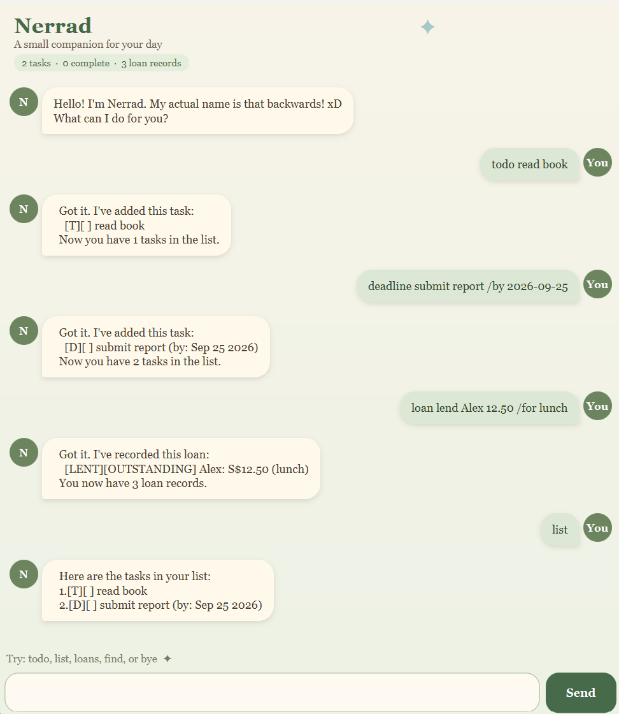

# Nerrad User Guide

Nerrad is a small companion for keeping track of tasks and informal loans.
It is designed for quick keyboard-based use: type a command, press Enter, and
Nerrad keeps the record for you.

## Quick start

1. Ensure Java 25 is installed.
2. Download `nerrad.jar` from the project's GitHub release.
3. Open a terminal in the folder containing the JAR file.
4. Run `java -jar nerrad.jar`.
5. Type a command in the input box and press Enter, or select **Send**.

Nerrad saves its data automatically in a `data` folder next to where it is
run. Your tasks and loan records are restored the next time you open it.

## Command format

* Words in `UPPER_CASE` are values that you supply.
* Square brackets indicate optional parts.
* Task and loan numbers start at 1, as shown by `list` and `loans`.
* Commands and keywords are case-sensitive. For example, use `todo`, not
  `Todo`.

## Managing tasks

### Add a to-do

Adds a task without a date or time.

`todo DESCRIPTION`

Example: `todo buy groceries`

### Add a deadline

Adds a task due on a specific date. Dates must use the ISO format
`yyyy-MM-dd`.

`deadline DESCRIPTION /by yyyy-MM-dd`

Example: `deadline submit report /by 2026-09-25`

### Add an event

Adds a task with a start and end description. Use any clear date or time
wording for the start and end values.

`event DESCRIPTION /from START /to END`

Example: `event project meeting /from Mon 2pm /to 4pm`

### List tasks

Shows every task and its current completion status.

`list`

Task types are shown as `[T]` (to-do), `[D]` (deadline), or `[E]` (event).
`[X]` means complete and `[ ]` means incomplete.

### Mark or unmark a task

Marks a task as done, or changes it back to not done.

* `mark TASK_NUMBER`
* `unmark TASK_NUMBER`

Examples: `mark 2`, `unmark 2`

### Delete a task

Removes the specified task permanently.

`delete TASK_NUMBER`

Example: `delete 3`

### Find tasks

Shows tasks whose descriptions contain the keyword. The search is
case-sensitive.

`find KEYWORD`

Example: `find book`

## Tracking loans

Nerrad can record money you have lent to, or borrowed from, someone. Loan
amounts must be positive and can have at most two decimal places.

### Record a loan

* `loan lend PERSON AMOUNT [/for REASON]`
* `loan borrow PERSON AMOUNT [/for REASON]`

Examples:

* `loan lend Alex Tan 12.50 /for lunch`
* `loan borrow Ben 5 /for bus fare`

### List loans

Shows every loan record. A record is either `OUTSTANDING` or `SETTLED`.

`loans`

### Settle a loan

Marks a loan record as settled. Settled records remain in the list for
reference.

`settle-loan LOAN_NUMBER`

Example: `settle-loan 1`

## Exit

Closes Nerrad.

`bye`

## Getting help

If a command is incomplete or uses an invalid format, Nerrad explains the
problem in the chat. Check the relevant command format above and try again.
